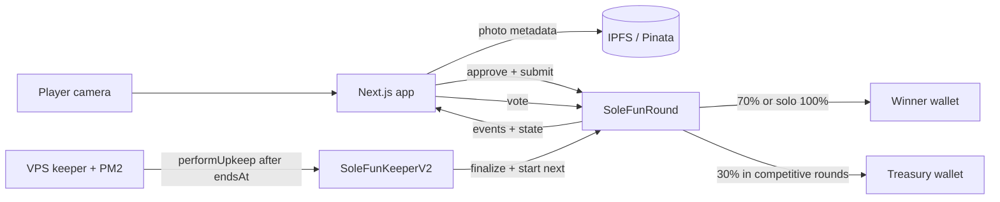

<div align="center">
  
  <h1>solefoot</h1>
  <p><strong>Snap a sole. Enter on-chain. Let the crowd decide.</strong></p>
  <p>A camera-first SocialFi game running live on Robinhood Chain.</p>

  <p>
    
    
    
    
  </p>

  

  <p>
    <a href="#how-a-round-moves">How it works</a> ·
    <a href="#live-mainnet-system">Live contracts</a> ·
    <a href="#proof-not-promises">Tests</a> ·
    <a href="#documentation">Docs</a>
  </p>
</div>

---

## The game in one breath

Take a fresh foot photo with the in-app camera, approve the current USDG entry price, and submit it
to the active round. Every wallet can enter once and vote once. When the on-chain timer expires, the
leading entry wins. The settlement transaction and payout amounts remain publicly verifiable.

No placeholder contestants. No pretend pool balance. If the contract has no entries, the interface
shows no entries.

## How a round moves

| 01 — Capture | 02 — Enter | 03 — Vote | 04 — Settle |
| --- | --- | --- | --- |
| The mobile camera captures a new photo. | Metadata is pinned to IPFS and `submitEntry` transfers the exact USDG price. | One eligible wallet gets one on-chain vote. | The keeper finalizes the ended round and opens the next one. |

### Payout logic

| Participants | Winner | Treasury | Why |
| ---: | ---: | ---: | --- |
| `0` | `0%` | `0%` | Nothing entered, nothing moves. |
| `1` | `100%` | `0%` | A solo player should not lose 30% for beating nobody. |
| `2+` | `70%` | `30%` | Competitive rounds fund the winner and treasury. |

USDG reaches the treasury automatically. The treasury's later token buyback is currently a manual
operation; the interface and docs do not claim otherwise.

## Live mainnet system

| Component | Address | Role |
| --- | --- | --- |
| Round | [`0x81F2…04da`](https://robinhoodchain.blockscout.com/address/0x81F2108A8B25943BdF26811714c78C6beF1704da) | Entries, votes, pool accounting and payouts |
| Keeper V2 | [`0x5956…30f3`](https://robinhoodchain.blockscout.com/address/0x5956a06B5b2D93416392C04aF52c2c38864730f3) | Finalizes an ended round and starts the next one |
| USDG | [`0x5fc5…d168`](https://robinhoodchain.blockscout.com/address/0x5fc5360D0400a0Fd4f2af552ADD042D716F1d168) | ERC-20 entry and payout asset |

```text
Network       Robinhood Chain mainnet
Chain ID      4663
Entry price   1 USDG
Round length  24 hours
Token gate    Disabled until the project token exists
```

## Architecture



The VPS is an automation caller, not an oracle. It cannot select a winner or rewrite votes. If it is
temporarily offline, USDG remains in the round contract and upkeep can be retried after `endsAt`.

## Proof, not promises

The Foundry suite currently contains **27 contract checks** covering:

- 70/30 competitive settlement and most-voted winner selection
- 100% return to a solo entrant
- zero-entry finalization
- tie behavior, where the first entry to reach a score stays ahead
- one entry and one vote per wallet
- metadata validation and finalized-round rejection paths
- rejection of early finalization
- future-round-only configuration updates
- optional historical token-gate snapshots
- owner-only emergency recovery and permanent stop behavior
- Keeper V2 ownership, pause, authorized upkeep, restart and emergency forwarding
- invariant/property runs where randomized start, enter, vote, warp, finalize and emergency actions
  must keep held USDG aligned with the unsettled pool and keep settled payouts below each pool

The repository includes a GitHub Actions workflow definition for the frontend production build,
Solidity formatting check and complete Foundry suite. Publishing or changing that workflow through a
GitHub token requires the token to include `workflow` permission. Until GitHub shows a green Actions
run on the repository, run the same checks locally:

```bash
npm ci
npm run build

forge fmt --check
forge test --offline
```

## Documentation

| Read | What it answers |
| --- | --- |
| [System architecture](docs/ARCHITECTURE.md) | How camera, IPFS, wallet, contracts and VPS automation fit together |
| [Contracts and live addresses](docs/CONTRACTS.md) | Ownership, public methods, payouts and emergency behavior |
| [Testing guide](docs/TESTING.md) | What is covered, how to run it and what tests cannot guarantee |
| [Live proof](docs/LIVE_PROOF.md) | Mainnet deployment, automation and settlement evidence |
| [Security notes](docs/SECURITY.md) | Owner powers, emergency recovery and launch trust boundaries |
| [Contract deployment notes](contracts/README.md) | Foundry configuration and deployment commands |

## Local development

```bash
npm install
npm run dev
```

Create `.env.local` and add `PINATA_JWT` for server-side uploads. Never commit that file and never
expose the token through a `NEXT_PUBLIC_` variable. The keeper uses its own encrypted Foundry
keystore on the VPS; neither the keystore nor its password belongs in this repository.

## Repository map

```text
app/          Next.js interface and server routes
contracts/    Round and keeper Solidity contracts
docs/         Architecture, contract and testing documentation
keeper/       VPS automation process
script/       Foundry deployment scripts
test/         Foundry contract tests
```

## Security status

This software handles real mainnet funds. Passing tests are not an independent audit. The emergency
withdrawal path permanently stops the game and sends contract-held USDG to the immutable original
deployer address. Review the source, operational assumptions and live contract state before use.

The live keeper is still controlled by a single owner key for pause, keeper rotation, future-round
config forwarding and emergency forwarding. For a larger public launch, move that owner to a multisig
or deploy a stricter keeper before advertising the system as trust-minimized.

<div align="center">
  <sub>built from the ground up — toe by toe.</sub>
</div>
